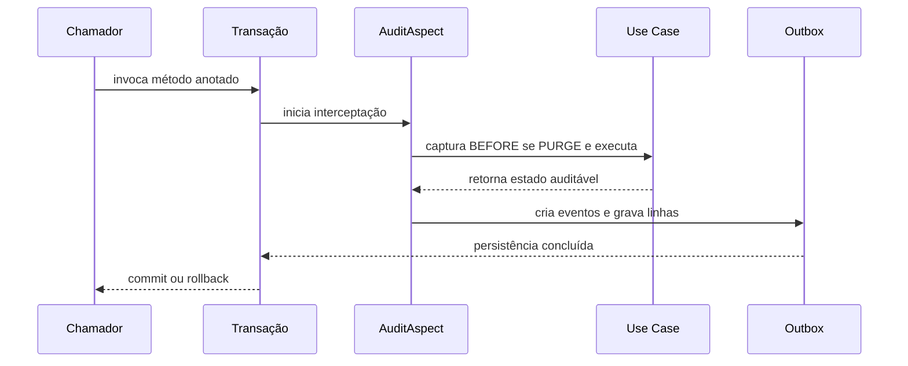

# Arquitetura interna do platform-audit

Este documento explica a responsabilidade de cada classe Java do módulo, como os pacotes se relacionam e o caminho de uma chamada auditada. Ele descreve o código atual da etapa de captura e gravação transacional da outbox.

## Limite de responsabilidade

O serviço consumidor executa a regra de negócio, mantém a tabela/migration da outbox, declara a entidade JPA concreta e o repository tipado, e fornece o estado de retorno auditável. A library intercepta o Use Case, captura o estado, resolve os metadados e grava a outbox.

Nesta etapa, não há worker, publicação em fila ou gravação em Object Storage. Os estados de claim/retry já fazem parte do modelo da tabela para a evolução posterior, mas não significam que exista um processador desses estados neste módulo.

## Fluxo de uma invocação

A configuração registra a interceptação transacional na ordem 100 e o `AuditAspect` na ordem 200. Assim, a transação começa antes da validação do Aspect e só termina depois que a linha da outbox foi gravada.

1. O Transaction Interceptor abre a transação.
2. `AuditAspect` localiza a anotação no método efetivo e confirma que a transação está ativa.
3. `AuditSnapshotCollector` valida as ações e captura o estado anterior quando a ação é `PURGE`.
4. O Aspect executa o método de negócio.
5. Para as outras ações, o collector captura o retorno. Se o retorno for uma coleção, cada elemento vira um snapshot.
6. `AuditInvocationEventFactory` transforma os snapshots em eventos, antes de iniciar as gravações.
7. `AuditEventFactory` serializa cada payload, verifica `identifier`/`id` e compõe os metadados com o contexto atual.
8. `AuditOutboxAppender` instancia a entidade concreta registrada no metamodelo JPA e chama o repository.
9. A transação confirma o negócio e a outbox juntas. Qualquer falha propaga a exceção e reverte a transação.

## Pacotes e classes

### `annotation`

| Classe | Objetivo |
| --- | --- |
| `Auditable` | Anotação colocada no método de Use Case. Declara `action`, o nome do fato de negócio (`event`) e o tipo de recurso (`resourceType`). É repetível para declarar mais de um fato no mesmo método. |
| `Auditables` | Container gerado pelo mecanismo de anotação repetível do Java. O código de aplicação normalmente usa `@Auditable` várias vezes e não precisa declarar este container diretamente. |

### `aspect`

| Classe | Objetivo |
| --- | --- |
| `AuditAspect` | Orquestra o ciclo ao redor do método anotado: valida transação, resolve o método da implementação, captura antes/depois, chama a regra, cria os eventos e pede a gravação na outbox. |
| `AuditSnapshotCollector` | Decide de qual lado da execução obter o snapshot. Valida ações; para `PURGE`, chama o provider de estado anterior; para as outras ações, usa o retorno do método. Expande um retorno que seja coleção em vários snapshots. |
| `CapturedAuditSnapshot` | Par simples que mantém juntos a anotação que descreve o evento e o objeto/estado que será auditado. É uma estrutura interna entre o collector e a fábrica de eventos. |
| `AuditInvocationEventFactory` | Converte a lista de snapshots da invocação em eventos completos. Constrói o lote antes que o Aspect grave qualquer linha, para que validações e serializações ocorram primeiro. |

### `autoconfigure`

| Classe | Objetivo |
| --- | --- |
| `PlatformAuditAutoConfiguration` | Configuração Spring Boot da library. Registra propriedades, validação e beans padrão; respeita `platform.audit.enabled`; permite substituição de componentes designados com `@ConditionalOnMissingBean`; habilita transações com ordem 100. |

### `config`

| Classe | Objetivo |
| --- | --- |
| `PlatformAuditProperties` | Mapeia `platform.audit.enabled` e `platform.audit.service-name` da configuração da aplicação. A auditoria está habilitada por padrão. |
| `AuditPropertiesValidator` | Falha a inicialização quando a auditoria está ativa e o nome lógico do serviço não foi informado. |

### `context`

| Classe | Objetivo |
| --- | --- |
| `AuditAuthorizationContextResolver` | Lê o `UserContext` da plataforma e converte a sessão atual em `AuditContext`. Se não existir contexto, produz o erro funcional correspondente. |

### `event`

| Classe | Objetivo |
| --- | --- |
| `AuditEventFactory` | Valida a definição do evento, converte o snapshot em `JsonNode`, exige `identifier` ou `id`, consulta o contexto e cria o JSON dos metadados. O tipo interno `CapturedAuditEvent` transporta os dois JSONs até a outbox. |

### `exception`

| Classe | Objetivo |
| --- | --- |
| `AuditException` | Exceção funcional da auditoria. Estende `ApiException` do padrão de messaging da plataforma e carrega a chave de mensagem, opcionalmente com a causa original. |

### `message`

| Classe | Objetivo |
| --- | --- |
| `AuditMessageKeys` | Centraliza as chaves de mensagens para falhas funcionais, como contexto ausente, snapshot inválido e transação ausente. |
| `AuditTechnicalErrors` | Define erros de configuração técnica da library usando `PlatformErrorDefinition`, como nome de serviço ausente ou entidade de outbox inexistente/duplicada. |

### `model`

| Classe | Objetivo |
| --- | --- |
| `AuditAction` | Estratégia técnica que define o momento de captura. `PURGE` captura antes; as demais ações implementadas capturam o retorno. O valor não é persistido como fato de negócio. `CUSTOM` ainda não tem estratégia e falha quando usado. |
| `AuditContext` | Dados de identidade e rastreamento lidos da sessão atual: account, application, environment, actor e correlation id. |
| `AuditMetadata` | Modelo dos metadados do evento: serviço, tipo de recurso, fato, identificador, contexto e instante de ocorrência. |
| `AuditOutboxStatus` | Estados técnicos da linha de outbox (`PENDING`, `PROCESSING`, `PROCESSED`, `RETRY`, `FAILED`). Nesta etapa o fluxo grava como `PENDING`; o worker que avançará os demais estados ainda não está neste módulo. |

### `outbox`

| Classe | Objetivo |
| --- | --- |
| `AuditBeforeSnapshotProvider` | Extensão opcional da aplicação para fornecer o estado persistido antes de um `PURGE`. Recebe método, argumentos e anotação; devolve um `JsonNode`. |
| `AuditOutboxEntity` | Mapeamento JPA abstrato comum (`@MappedSuperclass`) para a tabela do consumidor. Contém payload e metadados JSON, identificador, estado técnico e colunas de controle. Inicializa identificador/status e recebe payload/metadata antes da persistência. |
| `AuditOutboxRepository` | Contrato genérico `@NoRepositoryBean` baseado em `JpaRepository`. Cada serviço cria uma interface tipada para sua entidade concreta. Seu método `append` encaminha a entidade ao `save` do Spring Data. |
| `AuditOutboxAppender` | Ponte entre evento e persistência. Procura no metamodelo JPA exatamente uma entidade concreta que estenda `AuditOutboxEntity`, valida na inicialização se o repository injetado gerencia essa entidade, instancia-a, prepara payload e metadados e grava pelo repository. Mantém a resolução de JPA escondida do Aspect. |

## Arquivos de suporte

- `META-INF/spring/org.springframework.boot.autoconfigure.AutoConfiguration.imports`: torna `PlatformAuditAutoConfiguration` descobrível pelo Spring Boot.
- `META-INF/platform-messages/audit_pt_BR.properties` e `audit_en.properties`: textos de mensagens nos idiomas suportados.
- `platform-audit/db/mysql/create-audit-outbox.sql`: DDL de referência para o serviço consumidor copiar para sua própria migration.
- Testes em `src/test`: cobrem interceptação, configuração automática, resolução de contexto, bundle de mensagens, appender e atomicidade entre domínio e outbox.

## Decisões e restrições que afetam o fluxo

- A anotação pertence ao método público de Service/Use Case chamado por um proxy Spring. Autoinvocação dentro da mesma classe não ativa o Aspect.
- A transação precisa estar ativa antes do Aspect. A configuração da library usa ordem 100 para o gerenciamento transacional e ordem 200 para `AuditAspect`.
- A sessão `UserContext` precisa existir para compor os metadados.
- O snapshot precisa ser um objeto JSON com `identifier` ou `id`. Uma coleção de retorno gera uma linha por elemento; a library não aplica limites de tamanho ou quantidade.
- O consumidor possui a tabela física e declara a entidade concreta e o repository correspondente. Por unidade de persistência, a resolução exige exatamente uma entidade concreta de outbox e verifica na inicialização se o repository injetado gerencia essa entidade.
- A entidade mapeia JSON por `@JdbcTypeCode(SqlTypes.JSON)` e usa `tools.jackson.databind.JsonNode`. A autoconfiguração não substitui/configura globalmente o `ObjectMapper` da aplicação.
- A persistência da outbox é transacional; esta etapa não publica o evento nem executa processamento assíncrono posterior.
