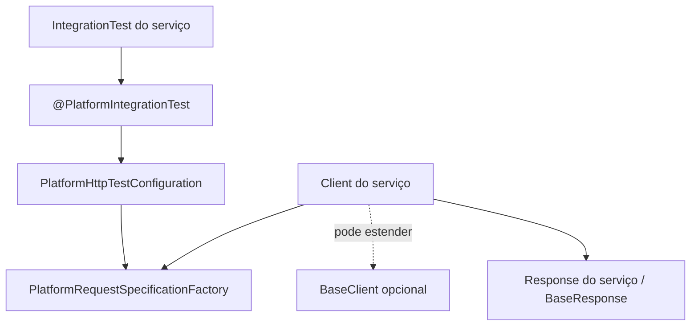
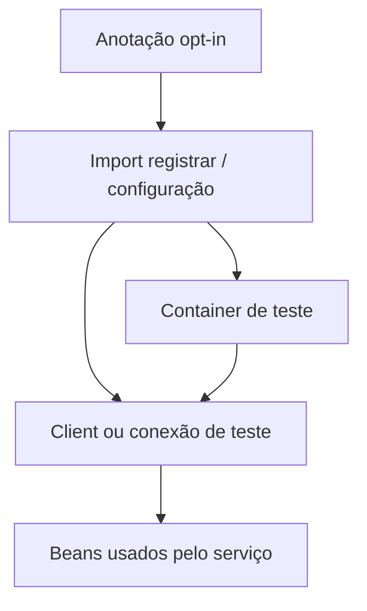
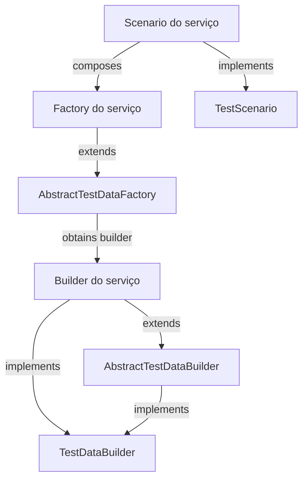
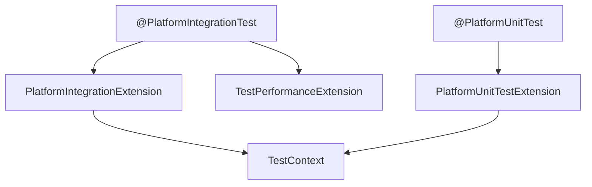
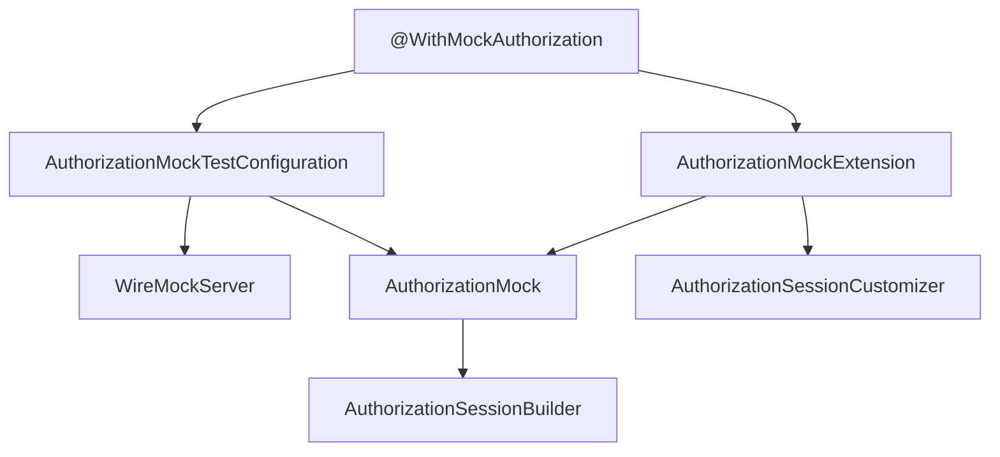
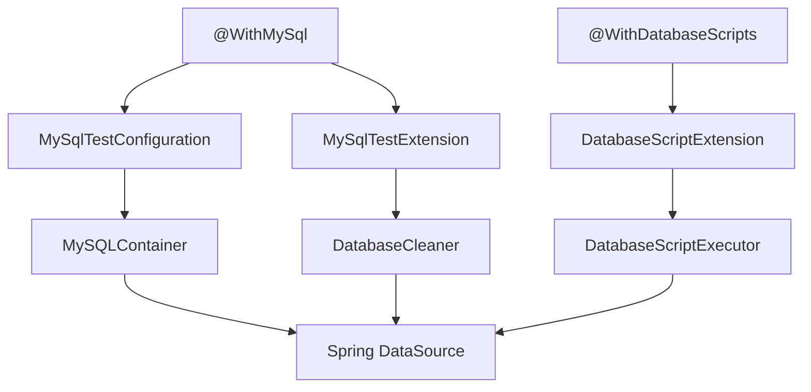
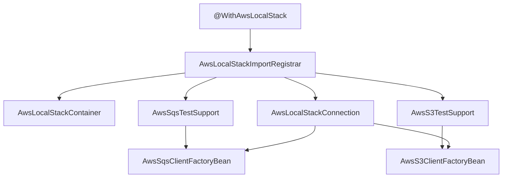
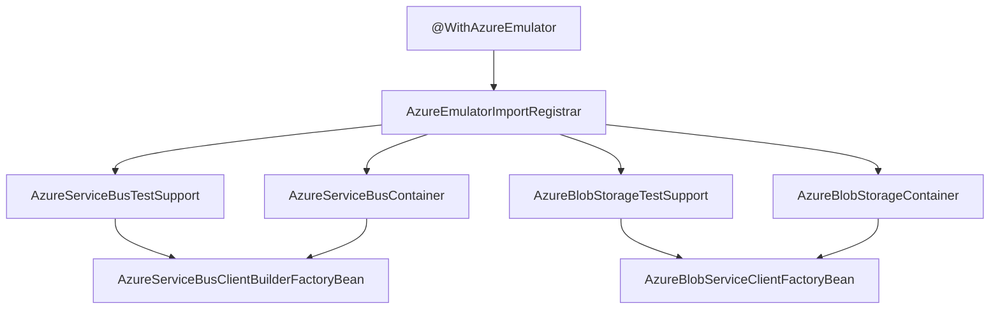
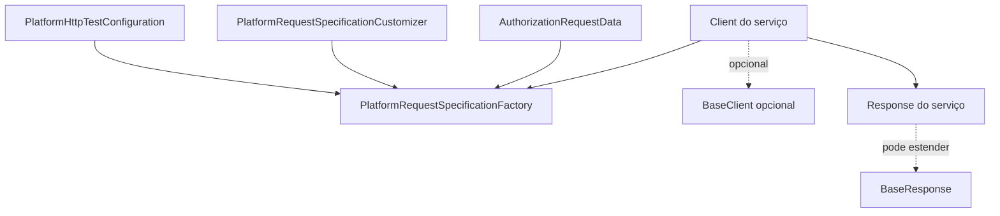
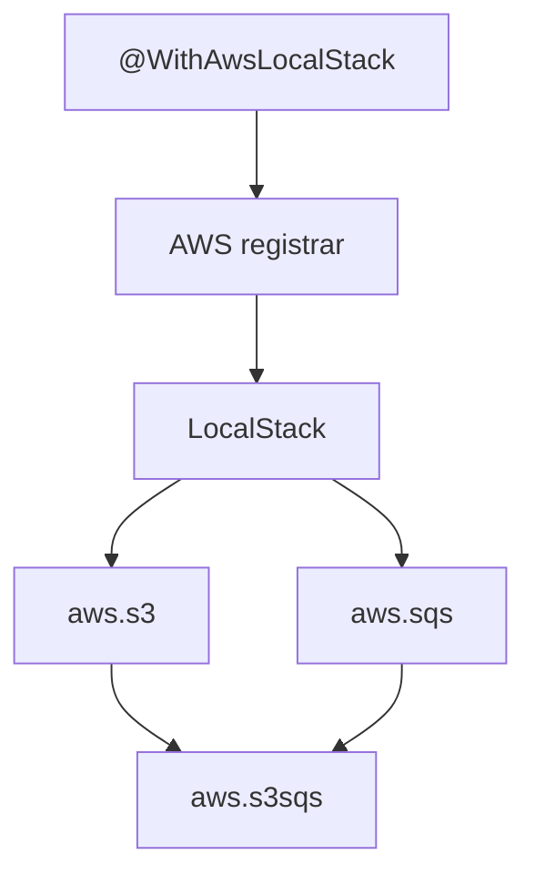

# Mapa visual das APIs de teste da plataforma

O mapa cobre as APIs de `platform-testing-core` e `platform-testing-authorization`; as fixtures de autorização ficam no segundo artefato.

Este guia mostra como as peças do módulo se conectam e, em seguida, descreve **todas as classes de produção, pacote por pacote**. Use os diagramas para entender o caminho de execução e as tabelas para consultar o papel e as relações de cada classe.

As setas indicam configuração, criação, chamada ou uso. Quando uma classe fica no microsserviço consumidor, isso está indicado explicitamente. Classes internas com visibilidade de pacote são identificadas como apoio interno.

## Visão geral: onde o teste encontra a biblioteca

O teste seleciona os recursos de infraestrutura por anotações. A anotação importa a configuração ou o registrar correspondente; esse componente cria somente os containers e clients pedidos.

## Builder, factory e scenario

O módulo oferece os contratos e as classes-base. As implementações concretas ficam no contexto do serviço, para montar dados de domínio e preparar pré-condições.

**Como ler:** o builder constrói um objeto; a factory usa o builder para expor variações semânticas; um scenario combina a massa e a preparação de pré-condições. A biblioteca não fornece scenarios de domínio prontos.

## Anotações, extensões e recursos

## Autorização simulada

A configuração cria o servidor e direciona as propriedades da aplicação para ele. A extensão limpa os stubs antes de cada teste e registra a resposta padrão. O mock também permite respostas específicas por headers de workspace, aplicação e ambiente.

## Banco MySQL e scripts

A limpeza do banco e a execução de scripts são mecanismos separados: **MySqlTestExtension** limpa tabelas; **DatabaseScriptExtension** executa setup e cleanup configurados.

## AWS LocalStack

O registrar registra somente os apoios SQS e S3 declarados. Esses apoios criam os factory beans; os factory beans usam a conexão do LocalStack para produzir os clients do AWS SDK.

## Emuladores Azure

Service Bus coordena o emulador e o SQL Server requerido por ele. Blob Storage usa Azurite e cria os containers especificados na anotação.

## HTTP: criar request, chamar endpoint, validar resposta

## Inventário por pacote

### br.com.portalmanager.platform.library.testing.architecture

| Classe | O que faz | Relação com as demais |
|---|---|---|
| **PlatformArchitectureExtension** | Analisa classes concretas do serviço e exige testes para customizações de comportamento herdado da plataforma. | É ativada por **PlatformArchitectureTest**; lê cobertura explícita de **CoversClasses** e também reconhece a convenção de nomes de testes. |

### br.com.portalmanager.platform.library.testing.architecture.annotation

| Classe | O que faz | Relação com as demais |
|---|---|---|
| **PlatformArchitectureTest** | Anotação opt-in que define pacotes do serviço e pacotes base observados. | Ativa **PlatformArchitectureExtension**. |
| **CoversClasses** | Declara as classes de produção cobertas por uma classe de teste. | Lida por **PlatformArchitectureExtension** para aceitar cobertura explícita, inclusive quando um teste cobre vários tipos. |

### br.com.portalmanager.platform.library.testing.authorization

| Classe | O que faz | Relação com as demais |
|---|---|---|
| **AuthorizationMock** | Expõe operações de stubbing e verificação para o endpoint de autorização no WireMock. | Recebe o **WireMockServer** criado por **AuthorizationMockTestConfiguration**; usa **AuthorizationSessionBuilder** e **AuthorizationResourceMatcher** ao montar respostas. |
| **AuthorizationMockExtension** | Limpa o mock e define a resposta padrão antes de cada teste. | É ativada por **WithMockAuthorization**; busca **AuthorizationMock** e os beans **AuthorizationSessionCustomizer** no contexto Spring. |
| **AuthorizationMockResult** | Enum de resultados padrão: permitido, negado, proibido ou erro interno. | O atributo default de **WithMockAuthorization** é lido por **AuthorizationMockExtension**. |
| **AuthorizationMockTestConfiguration** | Cria WireMock, **AuthorizationMock** e propriedades que apontam a aplicação para o servidor local. | É importada por **WithMockAuthorization**; fornece os beans consumidos pela extensão. |
| **AuthorizationResourceMatcher** | Monta condições de headers para um stub específico por workspace, aplicação, ambiente ou header livre. | A função de configuração é passada a **AuthorizationMock.customResource** e **allowResource**. |
| **AuthorizationSessionBuilder** | Produz **UserSession** com valores úteis para testes e customização fluente. | É usado por **AuthorizationMock** e recebe alterações de **AuthorizationSessionCustomizer**. |
| **AuthorizationSessionCustomizer** | Contrato funcional para adicionar atributos a uma sessão de teste. | Implementações do serviço viram beans que **AuthorizationMockExtension** aplica às sessões permitidas. |

### br.com.portalmanager.platform.library.testing.authorization.annotation

| Classe | O que faz | Relação com as demais |
|---|---|---|
| **WithMockAuthorization** | Ativa a simulação de autorização numa classe de teste e escolhe o resultado padrão. | Importa **AuthorizationMockTestConfiguration** e registra **AuthorizationMockExtension**; usa **AuthorizationMockResult**. |

## Cloud testing packages

The provider package keeps only the shared emulator lifecycle and its registrar. Each capability lives under its own feature package; annotations follow the feature they configure.

### br.com.portalmanager.platform.library.testing.cloud

| Class | Responsibility | Relationship |
|---|---|---|
| `CloudTestContextCustomizerFactory` | Captures AWS/Azure annotation values in Spring's context cache key. | Loaded through Spring Test SPI; prevents reusing a context that was provisioned with different resources or images. |

### AWS shared package: `testing.cloud.aws`

| Class | Responsibility | Relationship |
|---|---|---|
| `AwsLocalStackImportRegistrar` | Reads the provider-level annotation, validates its image and wires LocalStack plus enabled feature support. | Imported by `WithAwsLocalStack`; delegates client registration to the S3 and SQS feature packages. |
| `AwsLocalStackContainer` | Starts LocalStack and provisions the declared queues, DLQs, buckets and notifications. | Receives normalized configuration from the registrar; feature annotations select those resources. |
| `AwsLocalStackConnection` | Exposes endpoint, region and credentials from the running container. | Injected into S3 and SQS client factories. |
| `AwsService` | Maps supported LocalStack services to their LocalStack names. | Used by the container to start only the requested services. |

### AWS provider annotation: `testing.cloud.aws.annotation`

| Annotation | Responsibility | Relationship |
|---|---|---|
| `WithAwsLocalStack` | Enables the LocalStack provider and composes optional feature declarations. | Imports the registrar; embeds feature annotations from `aws.s3.annotation`, `aws.sqs.annotation` and `aws.s3sqs.annotation`. |

### AWS S3: `testing.cloud.aws.s3`

| Class | Responsibility | Relationship |
|---|---|---|
| `AwsS3ClientFactoryBean` | Creates and closes the AWS SDK `S3Client` against LocalStack. | Uses `AwsLocalStackConnection`; registered by `AwsS3TestSupport`. |
| `AwsS3TestSupport` | Registers the S3 client factory when the S3 feature is enabled. | Called by the provider registrar when `@AwsS3` is present. |

Annotation package `testing.cloud.aws.s3.annotation`: `AwsS3` declares the buckets to provision; the registrar passes them to LocalStack.

### AWS SQS: `testing.cloud.aws.sqs`

| Class | Responsibility | Relationship |
|---|---|---|
| `AwsSqsClientFactoryBean` | Creates and closes the AWS SDK `SqsClient` against LocalStack. | Uses `AwsLocalStackConnection`; registered by `AwsSqsTestSupport`. |
| `AwsSqsTestSupport` | Registers the SQS client factory when the SQS feature is enabled. | Called by the provider registrar when `@AwsSqs` is present. |

Annotation package `testing.cloud.aws.sqs.annotation`: `AwsSqs` declares queues and optional DLQ policies; its nested `Queue` describes each queue.

### AWS S3-to-SQS integration: `testing.cloud.aws.s3notificationsqs`

Annotation package `testing.cloud.aws.s3notificationsqs.annotation`: `AwsS3SqsNotification` links a declared bucket to a declared standard queue. The provider registrar validates both feature declarations and the LocalStack container provisions the notification and queue policy.

### Azure shared package: `testing.cloud.azure`

| Class | Responsibility | Relationship |
|---|---|---|
| `AzureEmulatorImportRegistrar` | Reads and validates image settings, then registers only selected emulator services and clients. | Imported by `WithAzureEmulator`; delegates to the Blob and Service Bus feature packages. |
| `AzureServiceTestSupport` | Shared contract for registering a service-specific Spring test client. | Implemented by the Azure Service Bus support and consumed by the registrar. |

Provider annotation package `testing.cloud.azure.annotation`: `WithAzureEmulator` enables the Azure emulators and composes optional feature annotations.

### Azure Blob Storage: `testing.cloud.azure.blob`

| Class | Responsibility | Relationship |
|---|---|---|
| `AzureBlobStorageContainer` | Starts Azurite and creates the configured containers. | Created by the provider registrar from `@AzureBlobStorage`. |
| `AzureBlobStorageTestSupport` | Registers the Blob client factory. | Called by the registrar when Blob Storage is enabled. |

Feature annotation package `testing.cloud.azure.blob.annotation`: `AzureBlobStorage` lists Blob containers to provision.

### Azure Service Bus: `testing.cloud.azure.servicebus`

| Class | Responsibility | Relationship |
|---|---|---|
| `AzureServiceBusContainer` | Coordinates SQL Server and Service Bus Emulator startup. | Created from `@AzureServiceBus`; supplies connection data to the client factory. |
| `AzureServiceBusClientBuilderFactoryBean` | Creates the SDK `ServiceBusClientBuilder` pointed to the emulator. | Uses `AzureServiceBusContainer`; registered by `AzureServiceBusTestSupport`. |
| `AzureServiceBusTestSupport` | Registers the Service Bus client builder. | Called when the Service Bus feature is enabled. |

Feature annotation package `testing.cloud.azure.servicebus.annotation`: `AzureServiceBus` declares queues, sessions and delivery settings.

### Azure Blob-to-Service Bus integration: `testing.cloud.azure.blobservicebus`

| Class | Responsibility | Relationship |
|---|---|---|
| `AzureBlobServiceClientFactoryBean` | Configures the Blob SDK client to emulate the upload-created event flow used by tests. | Adds `AzureBlobCreatedEventPolicy` to the Blob client pipeline. |
| `AzureBlobCreatedEventPolicy` | Converts a completed Blob upload into the event payload and sends it to Service Bus. | Uses the Service Bus emulator client; invoked by Blob SDK uploads in integration tests. |

### br.com.portalmanager.platform.library.testing.container

| Classe | O que faz | Relação com as demais |
|---|---|---|
| **PlatformTestingContainerImages** | Centraliza os nomes de imagem padrão do módulo, incluindo MySQL `8.4.11`. | Fornece defaults às fixtures; anotações como **WithMySql** permitem override por tag ou digest fixo. |

### br.com.portalmanager.platform.library.testing.context

| Classe | O que faz | Relação com as demais |
|---|---|---|
| **TestContext** | Mantém um correlation ID por thread e cria um ID quando ainda não existe. | A factory HTTP lê o ID; as extensões de ciclo de vida limpam o contexto ao redor de cada teste. |

### br.com.portalmanager.platform.library.testing.database

| Classe | O que faz | Relação com as demais |
|---|---|---|
| **CleanupMode** | Escolhe limpeza antes de cada teste, depois de cada teste ou nenhuma limpeza. | Configura **MySqlTestExtension** via **WithMySql**. |
| **DatabaseCleaner** | Descobre e trunca tabelas MySQL não excluídas; mantém cache da descoberta por banco. | Chamado por **MySqlTestExtension**; os scripts podem invalidar seu cache quando alteram o schema. |
| **DatabaseCleanupPhase** | Define execução do cleanup SQL depois de cada teste ou depois da classe. | Usado pelo atributo homônimo de **WithDatabaseScripts** e interpretado por **DatabaseScriptExtension**. |
| **DatabaseScriptExecutor** | Resolve, valida e executa os arquivos SQL indicados. | Chamado por **DatabaseScriptExtension** em cada fase configurada. |
| **DatabaseScriptExtension** | Executa setup e cleanup na classe ou no método e em ordem inversa para limpeza. | É ativada por **WithDatabaseScripts** e delega SQL a **DatabaseScriptExecutor**. |
| **DatabaseSetupPhase** | Define execução do setup SQL antes da classe ou antes de cada teste. | Usado por **WithDatabaseScripts** e interpretado por **DatabaseScriptExtension**. |
| **MySqlTestConfiguration** | Declara um MySQL Testcontainers como service connection do Spring Boot. | Importada por **WithMySql**; fornece o banco que a extensão de limpeza acessa. |
| **MySqlTestExtension** | Aplica o modo e as exclusões definidos na anotação MySQL. | É ativada por **WithMySql** e delega a limpeza a **DatabaseCleaner**. |

### br.com.portalmanager.platform.library.testing.database.annotation

| Classe | O que faz | Relação com as demais |
|---|---|---|
| **WithMySql** | Opt-in do MySQL e da limpeza automática de tabelas. | Importa **MySqlTestConfiguration**, registra **MySqlTestExtension** e define **CleanupMode** e tabelas excluídas. |
| **WithDatabaseScripts** | Declara arrays de scripts de setup e cleanup, fases de execução e se erros podem ser ignorados. | Registra **DatabaseScriptExtension**; agrupe arquivos na mesma anotação quando compartilham configuração e repita-a só para grupos com opções diferentes; **DatabaseScripts** é o container Java da repetibilidade. |
| **DatabaseScripts** | Contém várias declarações de **WithDatabaseScripts** no mesmo elemento Java. | É gerado pelo mecanismo de anotação repetível e lido pela extensão. |

### br.com.portalmanager.platform.library.testing.fixture

| Classe | O que faz | Relação com as demais |
|---|---|---|
| **TestClock** | Cria relógios fixos por instante, com UTC como fuso padrão. | Usado diretamente por builders, factories ou testes de domínio que precisam de tempo previsível. |
| **TestIds** | Gera UUID determinístico a partir de uma seed. | Usado diretamente por fixtures que precisam de identificadores reproduzíveis. |

### br.com.portalmanager.platform.library.testing.fixture.builder

| Classe | O que faz | Relação com as demais |
|---|---|---|
| **TestDataBuilder** | Contrato funcional: **build** produz o objeto ou DTO de teste. | Implementado por builders de domínio; aceito por **AbstractTestDataFactory**. |
| **AbstractTestDataBuilder** | Classe-base para builders fluentes com tipo concreto preservado por **self**. | Implementa **TestDataBuilder** e simplifica os métodos encadeáveis do builder do serviço. |

### br.com.portalmanager.platform.library.testing.fixture.factory

| Classe | O que faz | Relação com as demais |
|---|---|---|
| **TestDataFactory** | Contrato funcional que expõe a massa válida padrão por **valid**. | Implementado diretamente ou herdado por factories de domínio. |
| **AbstractTestDataFactory** | Cria a massa padrão ou aplica uma customização antes de construir o resultado. | Depende de um **TestDataBuilder** concreto; implementa **TestDataFactory**. |

### br.com.portalmanager.platform.library.testing.fixture.scenario

| Classe | O que faz | Relação com as demais |
|---|---|---|
| **TestScenario** | Contrato funcional para **setup** de pré-condições e retorno do resultado preparado. | Implementado no serviço consumidor; pode compor factories e clients, mas não depende de HTTP na biblioteca. |

### br.com.portalmanager.platform.library.testing.http

| Classe | O que faz | Relação com as demais |
|---|---|---|
| **AuthorizationRequestData** | Agrupa token, conta, ambiente e aplicação dos headers autorizados. | Criado pelo builder aninhado ou pelos valores padrão e consumido por **PlatformRequestSpecificationFactory**. |
| **BaseClient** | Helper de herança para criar requests, adaptar respostas e serializar corpos com o **JsonMapper** injetado. | Usa **PlatformRequestSpecificationFactory** e pode produzir classes de resposta que estendem **BaseResponse**; é opcional ao client do serviço. |
| **PlatformHttpTestConfiguration** | Registra a factory HTTP e coleta os customizadores ordenados do contexto. | Importada por **PlatformIntegrationTest**; fornece **PlatformRequestSpecificationFactory**. |
| **PlatformRequestSpecificationCustomizer** | Contrato para alterar um **RequestSpecBuilder** antes de cada request. | Implementado por configurações do serviço; instâncias são fornecidas à factory pela configuração HTTP. |
| **PlatformRequestSpecificationFactory** | Cria requests RestAssured novos com porta local, JSON, correlation ID e customizações; tem variantes autorizadas. | Usa **TestContext** e **AuthorizationRequestData**; é fornecida pela configuração HTTP e consumida pelos clients. |

### br.com.portalmanager.platform.library.testing.http.response

| Classe | O que faz | Relação com as demais |
|---|---|---|
| **BaseResponse** | Oferece assertions fluentes de status e corpo JSON, extração tipada e acesso à resposta HTTP. | Estendida por responses de domínio; clients concretos encapsulam o **ValidatableResponse** nela. |

### br.com.portalmanager.platform.library.testing.kafka

| Classe | O que faz | Relação com as demais |
|---|---|---|
| **KafkaTestConfiguration** | Cria o container Kafka como service connection do Spring Boot. | Lê as opções fornecidas por **KafkaTestContextCustomizerFactory** e fornece **KafkaTestContainer**. |
| **KafkaTestContainer** | Inicia Kafka e cria os tópicos opcionais declarados na anotação. | Estende o container Confluent e provisiona tópicos com AdminClient; serializers e producers continuam no serviço consumidor. |
| **KafkaTestContextCustomizerFactory** | Lê e valida imagem/tópicos da anotação e os encaminha ao contexto Spring. | É carregado via Spring Test SPI; seu customizer participa da chave do cache e separa contextos com imagem ou tópicos diferentes. |

### br.com.portalmanager.platform.library.testing.kafka.annotation

| Classe | O que faz | Relação com as demais |
|---|---|---|
| **WithKafka** | Habilita Kafka, permite escolher imagem e declara tópicos opcionais. | Importa **KafkaTestConfiguration** e é reconhecida por **KafkaTestContextCustomizerFactory**; o container só inicia quando a anotação é usada. |

### br.com.portalmanager.platform.library.testing.lifecycle

| Classe | O que faz | Relação com as demais |
|---|---|---|
| **PlatformIntegrationExtension** | Limpa o correlation ID antes e depois de cada teste de integração. | É registrada por **PlatformIntegrationTest** e opera sobre **TestContext**. |
| **PlatformUnitTestExtension** | Limpa correlation ID e MDC antes e depois de cada teste unitário. | É registrada por **PlatformUnitTest** e opera sobre **TestContext** e MDC. |
| **TestPerformanceExtension** | Mede a duração dos métodos, registra os lentos e resume tempos ao final da classe. | É registrada por **PlatformIntegrationTest** e não interfere no ciclo de negócio do teste. |

### br.com.portalmanager.platform.library.testing.lifecycle.annotation

| Classe | O que faz | Relação com as demais |
|---|---|---|
| **PlatformIntegrationTest** | Anotação composta de Spring Boot para teste HTTP de integração, profile **test** e servidor em porta aleatória. | Importa **PlatformHttpTestConfiguration** e registra **PlatformIntegrationExtension** e **TestPerformanceExtension**. |
| **PlatformUnitTest** | Anotação composta de Mockito e isolamento leve para testes unitários. | Registra **MockitoExtension** e **PlatformUnitTestExtension**; não sobe o contexto da aplicação. |

## Como manter este mapa útil

Ao adicionar, remover ou mover um tipo de produção, atualize a tabela do pacote. Se mudar quem importa, cria, registra ou chama uma classe, atualize também o diagrama do subsistema afetado.
