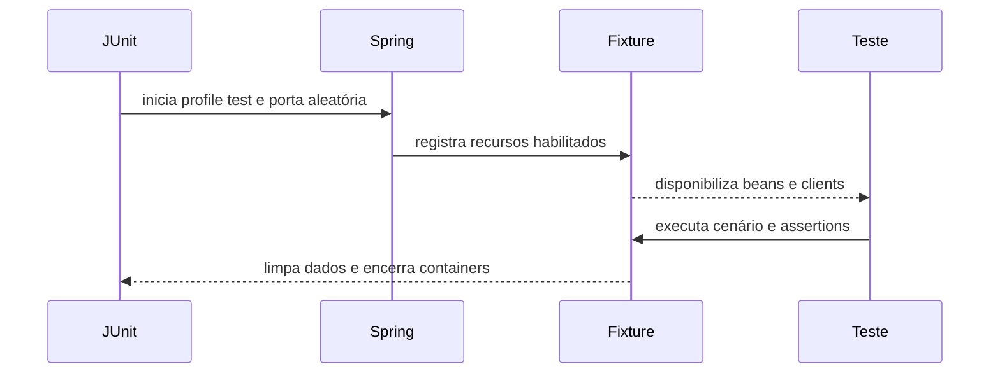

# Arquitetura interna do platform-testing

Este documento descreve as responsabilidades do módulo, a divisão dos pacotes e como as extensões conectam JUnit, Spring, Testcontainers, WireMock e ArchUnit.

## Escopo

`platform-testing` oferece suporte comum para testes unitários e de integração dos serviços da plataforma. Os recursos de infraestrutura são opt-in: o consumidor ativa banco, Kafka, autorização simulada ou cloud apenas quando o teste precisa deles.

O módulo não contém regras de negócio dos serviços. Builders, factories, cenários, clients e scripts específicos de domínio devem continuar no microsserviço.

## Estrutura de pacotes

| Pacote | Responsabilidade |
|---|---|
| `architecture` / `architecture.annotation` | Regra ArchUnit e anotação que exige cobertura para customizações de classes da plataforma. |
| `authorization` / `authorization.annotation` | WireMock, builders e anotação para simular respostas do serviço de autorização. |
| `cloud.aws` / `cloud.aws.annotation` | Suporte LocalStack para SQS/S3, configuração de filas, DLQ e clients AWS de teste; anotações ficam em `annotation`. |
| `cloud.azure` / `cloud.azure.annotation` | Suporte aos emuladores Azure para Service Bus e Blob Storage e seus clients; anotações ficam em `annotation`. |
| `context` | Estado de teste associado à thread, como correlation ID. |
| `database` / `database.annotation` | Container MySQL, limpeza de tabelas e execução de scripts SQL; anotações ficam em `annotation`. |
| `fixture` | Utilitários compartilhados para testes, como relógio e IDs. |
| `fixture.builder` | Contratos e classes-base para builders de massa de teste. |
| `fixture.factory` | Contratos e classes-base para factories de massa válida e variações semânticas. |
| `fixture.scenario` | Contrato para preparação de pré-condições e cenários compostos. |
| `http` | Criação de requests RestAssured, clients base e customização de requests. |
| `http.response` | Assertions fluentes para respostas HTTP. |
| `kafka` / `kafka.annotation` | Container Kafka conectado ao contexto Spring de teste; anotações ficam em `annotation`. |
| `lifecycle` / `lifecycle.annotation` | Extensões JUnit para inicialização, isolamento e métricas dos testes; anotações ficam em `annotation`. |

Cada contexto mantém suas anotações em um subpacote `annotation`, separado das configurações e extensões: `architecture.annotation`, `authorization.annotation`, `cloud.aws.annotation`, `cloud.azure.annotation`, `database.annotation`, `kafka.annotation` e `lifecycle.annotation`. HTTP não possui anotações próprias.

## Fluxo de um teste de integração

`@PlatformIntegrationTest` combina Spring Boot, servidor web em porta aleatória, profile `test`, configuração HTTP e extensões de ciclo de vida. As fixtures de infraestrutura são habilitadas separadamente pelas anotações do teste.

1. JUnit encontra a classe anotada.
2. Spring inicia a aplicação no profile `test` e escolhe uma porta aleatória.
3. A extensão de integração configura um correlation ID por teste.
4. Anotações opcionais registram seus containers, beans, clients ou scripts.
5. O teste usa clients HTTP ou os componentes diretamente.
6. As extensões executam limpeza e encerram os recursos ao final do ciclo de vida.

## Anotações e extensões

### Testes Spring e JUnit

- `PlatformIntegrationTest`: aplica `@SpringBootTest(RANDOM_PORT)`, profile `test`, configuração HTTP, `PlatformIntegrationExtension` e `TestPerformanceExtension`.
- `PlatformUnitTest`: ativa Mockito e a extensão que limpa o contexto de teste entre métodos.
- `WithMySql`: importa a configuração de container MySQL e ativa a limpeza conforme `CleanupMode`.
- `WithDatabaseScripts`: repetível em classe e método; a extensão executa setup e cleanup nas fases configuradas.
- `WithKafka`: importa uma configuração que cria o container Kafka e registra a conexão com Spring Boot Testcontainers.
- `WithMockAuthorization`: instala o WireMock e reinicia os stubs entre testes.
- `WithAwsLocalStack` e `WithAzureEmulator`: registram somente os serviços descritos nas anotações aninhadas.
- `PlatformArchitectureTest`: ativa a regra arquitetural explicitamente no serviço consumidor.

As anotações não sobem todos os serviços automaticamente. Por exemplo, `@PlatformIntegrationTest` não inicia MySQL nem Kafka por conta própria.

### Banco de dados

`MySqlTestConfiguration` disponibiliza MySQL pelo Testcontainers e Service Connections do Spring Boot. O default é `8.4.11`, configurado em `PlatformTestingContainerImages.MYSQL`; `@WithMySql(image = "mysql:8.4.0")` pode sobrescrever a imagem com uma tag ou digest fixo. A chave de cache do Spring considera a imagem, evitando compartilhar contexto entre versões. `MySqlTestExtension` interpreta `CleanupMode` antes/depois de cada método. O padrão é limpar antes de cada método, preservando `flyway_schema_history`.

`DatabaseCleaner` consulta tabelas base do schema MySQL, ignora as tabelas configuradas e usa `TRUNCATE` com verificações de chave estrangeira temporariamente desativadas. A descoberta de tabelas fica em cache por URL JDBC e catálogo; scripts SQL invalidam esse cache.

`DatabaseScriptExtension` resolve os caminhos por `ResourceLoader`, valida se os arquivos existem e executa setup/cleanup na ordem declarada. Cleanup de classe ou método é executado na ordem inversa das anotações correspondentes.

### Kafka e cloud

`KafkaTestContextCustomizerFactory` valida os valores da anotação e adiciona imagem/tópicos ao contexto; seus valores fazem parte da chave de cache do Spring. `KafkaTestConfiguration` cria `KafkaTestContainer` como service connection: ele inicia o broker e provisiona os tópicos declarados. Os defaults de imagens ficam em `PlatformTestingContainerImages`; as anotações permitem override por tag ou digest. Serializers e producers continuam no serviço consumidor.

Os registrars cloud interpretam as anotações e registram beans de container e clients correspondentes. `CloudTestContextCustomizerFactory` inclui os valores AWS/Azure na chave do cache do Spring para que recursos diferentes não compartilhem contexto:

- AWS: LocalStack com SQS e/ou S3. A anotação de provider permite trocar a imagem; a anotação de fila aceita configuração de DLQ, fila FIFO pelo nome e quantidade máxima de recebimentos.
- Azure: emulador para filas do Service Bus e containers do Blob Storage. Cada feature pode trocar sua imagem; Service Bus também permite trocar a imagem SQL que ele requer. Filas podem habilitar sessions e configurar `maxDeliveryCount`.

As dependências de Kafka, AWS e Azure são incluídas no artefato sem marcação opcional. O consumidor declara somente `platform-testing` com escopo `test`; as anotações ativam apenas os containers e serviços usados em cada teste.

## HTTP e contexto do teste

`PlatformRequestSpecificationFactory` cria uma especificação RestAssured nova para cada request, com porta local, JSON, correlation ID e customizadores registrados pelo consumidor. A variante autorizada acrescenta os headers e token descritos em `AuthorizationRequestData`.

`BaseClient` é um helper opcional para encapsular requests e serialização JSON com o `JsonMapper` configurado pela aplicação Spring Boot. `BaseResponse` oferece assertions comuns de status, campos e extração; o serviço pode estendê-lo para criar uma API fluente com vocabulário de domínio.

`TestContext` mantém o correlation ID do teste na thread atual. `PlatformIntegrationExtension` isola esse valor entre métodos para evitar vazamento de contexto.

## Autorização simulada

`AuthorizationMockTestConfiguration` registra um WireMock local e configura a biblioteca de autorização para usar seu endpoint. `AuthorizationMockExtension` reinicia o servidor entre métodos.

`AuthorizationMock` permite configurar sessões liberadas, respostas negadas, proibidas e erros; também verifica chamadas e headers. `AuthorizationSessionBuilder` cria sessões com valores de teste e oferece métodos para grupos, identidade, expiração e grupos do autorizador.

## Fixtures de dados

- `fixture.builder.TestDataBuilder<T>` e `fixture.builder.AbstractTestDataBuilder`: construção estrutural de dados.
- `fixture.factory.TestDataFactory<T>` e `fixture.factory.AbstractTestDataFactory`: cenários semânticos reutilizáveis.
- `fixture.scenario.TestScenario<R>`: contrato para preparar pré-condições.
- `TestClock`: cria `Clock.fixed` com instante e fuso explícitos.
- `TestIds`: gera UUID determinístico a partir de uma seed.

A biblioteca mantém Datafaker disponível para consumidores que geram dados de teste. Os objetos e regras de domínio dos serviços continuam fora deste módulo.

## Regra arquitetural

`PlatformArchitectureExtension` importa os pacotes do serviço definidos em `basePackages`, identifica classes concretas que sobrescrevem implementação herdada dos pacotes em `observedBasePackages` e exige teste correspondente. O padrão observado é `br.com.portalmanager.platform`.

A cobertura é reconhecida por `@CoversClasses` ou por convenção, com um teste no mesmo pacote cujo nome termine em `Test`, `IntegrationTest` ou `IT`. A busca por pacote respeita a fronteira entre pacotes; nomes iguais em pacotes diferentes não se cobrem.

A regra é opt-in e não é executada automaticamente para todos os serviços.

## Dependências e fronteiras

- A dependência de `platform-testing` deve ser declarada pelo consumidor com escopo `test`.
- Dependências de infraestrutura cloud, Kafka e os containers de MySQL são fornecidas transitivamente por `platform-testing`; o consumidor declara apenas essa biblioteca com escopo `test`.
- `spring-boot-starter-jdbc` permanece opcional para evitar ativar `DataSource` em aplicações sem banco. Serviços com JPA normalmente já recebem JDBC por sua dependência de persistência.
- RestAssured, WireMock, ArchUnit e as extensões Spring/JUnit implementam as capacidades descritas pelas APIs públicas.
- O módulo expõe Datafaker para compatibilidade com consumidores que já o utilizam em seus testes.

Os nomes dos pacotes públicos são parte da API Java. A organização atual está documentada em [ESTRUTURA_DE_PACOTES.md](../ESTRUTURA_DE_PACOTES.md); mudanças nesses imports exigem migração dos consumidores.
