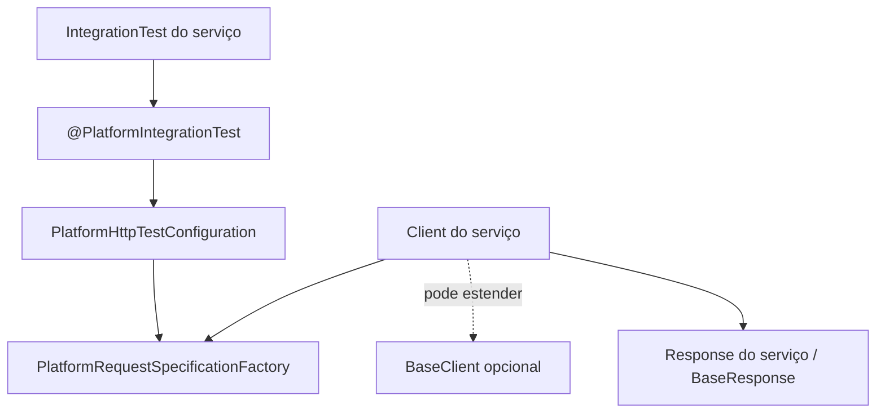
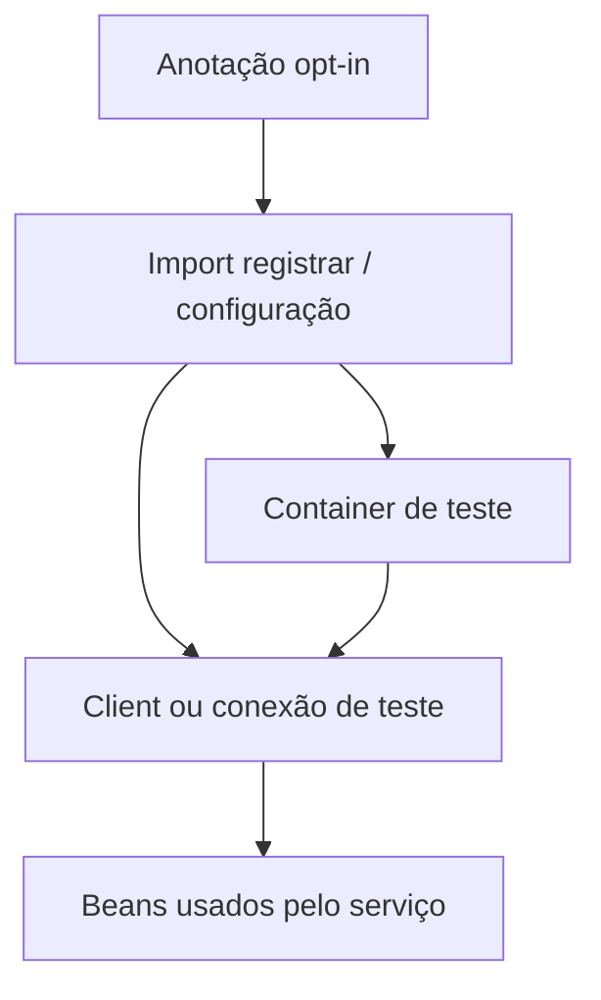
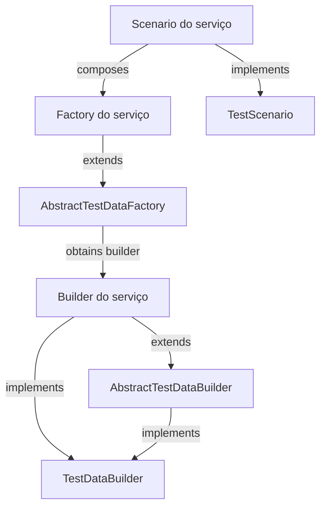
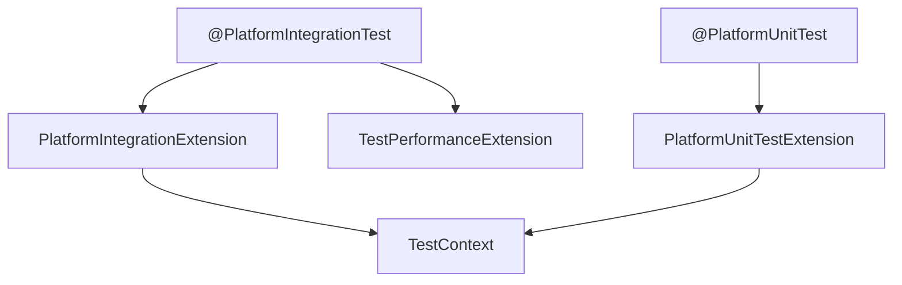
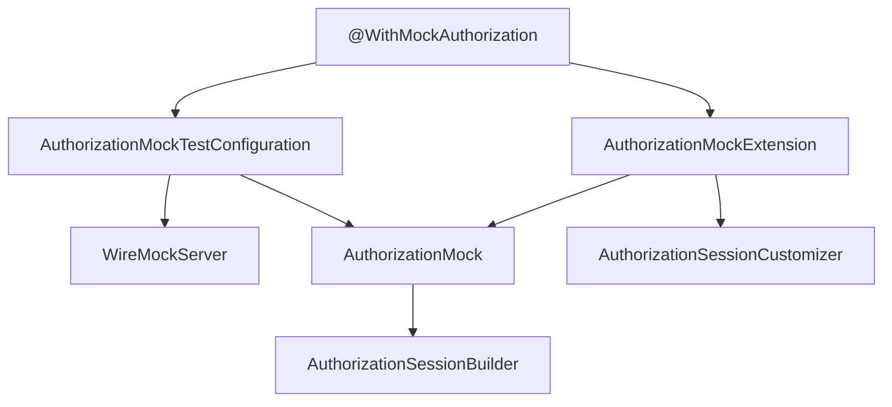
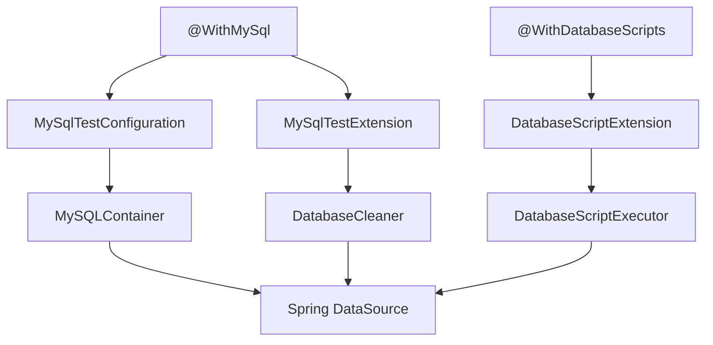
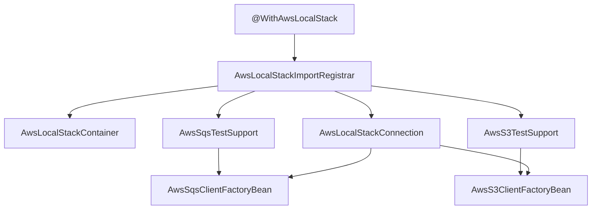
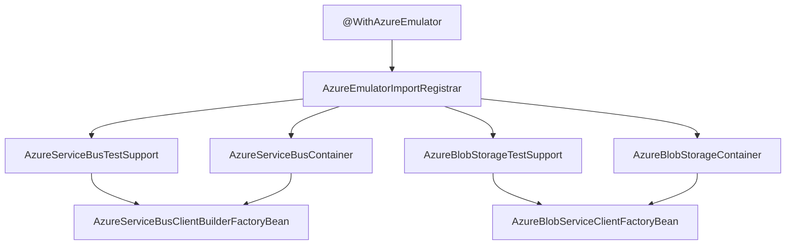
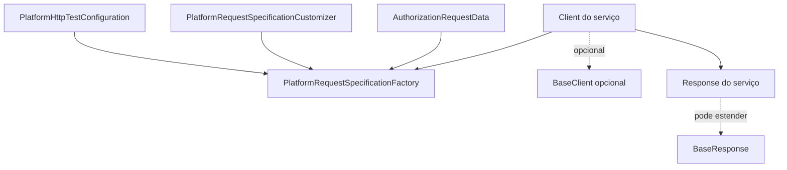

# Mapa visual de pacotes e classes do platform-testing

Este guia mostra como as peças do módulo se conectam e, em seguida, descreve **todas as classes de produção, pacote por pacote**. Use os diagramas para entender o caminho de execução e as tabelas para consultar o papel e as relações de cada classe.

As setas indicam configuração, criação, chamada ou uso. Quando uma classe fica no microsserviço consumidor, isso está indicado explicitamente. Classes internas com visibilidade de pacote são identificadas como apoio interno.

## Visão geral: onde o teste encontra a biblioteca

O teste seleciona os recursos de infraestrutura por anotações. A anotação importa a configuração ou o registrar correspondente; esse componente cria somente os containers e clients pedidos.

## Builder, factory e scenario

O módulo oferece os contratos e as classes-base. As implementações concretas ficam no contexto do serviço, para montar dados de domínio e preparar pré-condições.

**Como ler:** o builder constrói um objeto; a factory usa o builder para expor variações semânticas; um scenario combina a massa e a preparação de pré-condições. A biblioteca não fornece scenarios de domínio prontos.

## Anotações, extensões e recursos

## Autorização simulada

A configuração cria o servidor e direciona as propriedades da aplicação para ele. A extensão limpa os stubs antes de cada teste e registra a resposta padrão. O mock também permite respostas específicas por headers de workspace, aplicação e ambiente.

## Banco MySQL e scripts

A limpeza do banco e a execução de scripts são mecanismos separados: **MySqlTestExtension** limpa tabelas; **DatabaseScriptExtension** executa setup e cleanup configurados.

## AWS LocalStack

O registrar registra somente os apoios SQS e S3 declarados. Esses apoios criam os factory beans; os factory beans usam a conexão do LocalStack para produzir os clients do AWS SDK.

## Emuladores Azure

Service Bus coordena o emulador e o SQL Server requerido por ele. Blob Storage usa Azurite e cria os containers especificados na anotação.

## HTTP: criar request, chamar endpoint, validar resposta

## Inventário por pacote

### br.com.portalmanager.platform.library.testing.architecture

| Classe | O que faz | Relação com as demais |
|---|---|---|
| **PlatformArchitectureExtension** | Analisa classes concretas do serviço e exige testes para customizações de comportamento herdado da plataforma. | É ativada por **PlatformArchitectureTest**; lê cobertura explícita de **CoversClasses** e também reconhece a convenção de nomes de testes. |

### br.com.portalmanager.platform.library.testing.architecture.annotation

| Classe | O que faz | Relação com as demais |
|---|---|---|
| **PlatformArchitectureTest** | Anotação opt-in que define pacotes do serviço e pacotes base observados. | Ativa **PlatformArchitectureExtension**. |
| **CoversClasses** | Declara as classes de produção cobertas por uma classe de teste. | Lida por **PlatformArchitectureExtension** para aceitar cobertura explícita, inclusive quando um teste cobre vários tipos. |

### br.com.portalmanager.platform.library.testing.authorization

| Classe | O que faz | Relação com as demais |
|---|---|---|
| **AuthorizationMock** | Expõe operações de stubbing e verificação para o endpoint de autorização no WireMock. | Recebe o **WireMockServer** criado por **AuthorizationMockTestConfiguration**; usa **AuthorizationSessionBuilder** e **AuthorizationResourceMatcher** ao montar respostas. |
| **AuthorizationMockExtension** | Limpa o mock e define a resposta padrão antes de cada teste. | É ativada por **WithMockAuthorization**; busca **AuthorizationMock** e os beans **AuthorizationSessionCustomizer** no contexto Spring. |
| **AuthorizationMockResult** | Enum de resultados padrão: permitido, negado, proibido ou erro interno. | O atributo default de **WithMockAuthorization** é lido por **AuthorizationMockExtension**. |
| **AuthorizationMockTestConfiguration** | Cria WireMock, **AuthorizationMock** e propriedades que apontam a aplicação para o servidor local. | É importada por **WithMockAuthorization**; fornece os beans consumidos pela extensão. |
| **AuthorizationResourceMatcher** | Monta condições de headers para um stub específico por workspace, aplicação, ambiente ou header livre. | A função de configuração é passada a **AuthorizationMock.customResource** e **allowResource**. |
| **AuthorizationSessionBuilder** | Produz **UserSession** com valores úteis para testes e customização fluente. | É usado por **AuthorizationMock** e recebe alterações de **AuthorizationSessionCustomizer**. |
| **AuthorizationSessionCustomizer** | Contrato funcional para adicionar atributos a uma sessão de teste. | Implementações do serviço viram beans que **AuthorizationMockExtension** aplica às sessões permitidas. |

### br.com.portalmanager.platform.library.testing.authorization.annotation

| Classe | O que faz | Relação com as demais |
|---|---|---|
| **WithMockAuthorization** | Ativa a simulação de autorização numa classe de teste e escolhe o resultado padrão. | Importa **AuthorizationMockTestConfiguration** e registra **AuthorizationMockExtension**; usa **AuthorizationMockResult**. |

### br.com.portalmanager.platform.library.testing.cloud.aws

| Classe | O que faz | Relação com as demais |
|---|---|---|
| **AwsLocalStackConnection** | Extrai endpoint, região e credenciais do container LocalStack. | Criada pelo registrar e injetada em **AwsSqsClientFactoryBean** e **AwsS3ClientFactoryBean**. |
| **AwsLocalStackContainer** | Inicia LocalStack e provisiona serviços, filas, DLQs e buckets configurados. | Seus argumentos vêm de **AwsLocalStackImportRegistrar**, que lê as anotações AWS. |
| **AwsLocalStackImportRegistrar** | Interpreta os serviços AWS declarados e registra containers, conexão e clients Spring. | É importado por **WithAwsLocalStack**; delega o registro dos clients a **AwsSqsTestSupport** e **AwsS3TestSupport**. |
| **AwsS3ClientFactoryBean** | Cria e encerra o singleton SDK **S3Client** apontado ao LocalStack. | Usa **AwsLocalStackConnection**; é registrado por **AwsS3TestSupport**. |
| **AwsS3TestSupport** *(interno)* | Registra a definição Spring do factory bean S3. | Chamado pelo registrar somente quando **AwsS3** foi declarado. |
| **AwsService** | Mapeia nomes de serviço usados pelo LocalStack, incluindo SQS, S3, Secrets Manager, SNS e EventBridge. | O container usa o enum para iniciar os serviços solicitados; as anotações disponíveis atualmente selecionam SQS e S3. |
| **AwsSqsClientFactoryBean** | Cria e encerra o singleton SDK **SqsClient** apontado ao LocalStack. | Usa **AwsLocalStackConnection**; é registrado por **AwsSqsTestSupport**. |
| **AwsSqsTestSupport** *(interno)* | Registra a definição Spring do factory bean SQS. | Chamado pelo registrar somente quando **AwsSqs** foi declarado. |

### br.com.portalmanager.platform.library.testing.cloud.aws.annotation

| Classe | O que faz | Relação com as demais |
|---|---|---|
| **WithAwsLocalStack** | Anotação agregadora para habilitar SQS, S3 ou ambos no teste. | Importa **AwsLocalStackImportRegistrar** e contém configurações **AwsSqs** e **AwsS3**. |
| **AwsSqs** | Descreve filas e configurações de DLQ, recebimentos máximos e nome da fila. | O registrar lê seus atributos para provisionar recursos no **AwsLocalStackContainer**; possui a anotação aninhada **Queue**. |
| **AwsS3** | Descreve os buckets que o container deve criar. | O registrar passa os nomes para **AwsLocalStackContainer**. |

### br.com.portalmanager.platform.library.testing.cloud.azure

| Classe | O que faz | Relação com as demais |
|---|---|---|
| **AzureBlobServiceClientFactoryBean** | Cria o singleton SDK **BlobServiceClient** usando a connection string do Azurite. | Recebe **AzureBlobStorageContainer** e é registrado por **AzureBlobStorageTestSupport**. |
| **AzureBlobStorageContainer** | Inicia Azurite e cria os containers Blob declarados. | Criado por **AzureEmulatorImportRegistrar** a partir de **AzureBlobStorage**. |
| **AzureBlobStorageTestSupport** *(interno)* | Registra no Spring o factory bean do Blob client. | É chamado pelo registrar quando Blob Storage está habilitado. |
| **AzureEmulatorImportRegistrar** | Interpreta os serviços Azure declarados e registra somente containers e clients correspondentes. | É importado por **WithAzureEmulator**; delega o registro a **AzureServiceBusTestSupport** e **AzureBlobStorageTestSupport**. |
| **AzureServiceBusClientBuilderFactoryBean** | Cria o singleton SDK **ServiceBusClientBuilder** configurado para o emulador. | Recebe **AzureServiceBusContainer** e é registrado por **AzureServiceBusTestSupport**. |
| **AzureServiceBusContainer** | Coordena rede, SQL Server e Service Bus Emulator durante o teste. | É criado pelo registrar a partir de **AzureServiceBus** e fornece a connection string ao factory bean. |
| **AzureServiceBusTestSupport** *(interno)* | Registra no Spring a definição do builder Service Bus. | É chamado pelo registrar somente quando Service Bus foi declarado; implementa **AzureServiceTestSupport**. |
| **AzureServiceTestSupport** *(interno)* | Contrato interno para registrar o suporte Spring de um serviço Azure. | Implementado por **AzureServiceBusTestSupport** e usado pelo registrar para delegação. |

### br.com.portalmanager.platform.library.testing.cloud.azure.annotation

| Classe | O que faz | Relação com as demais |
|---|---|---|
| **WithAzureEmulator** | Anotação agregadora para habilitar Service Bus, Blob Storage ou ambos. | Importa **AzureEmulatorImportRegistrar** e contém configurações **AzureServiceBus** e **AzureBlobStorage**. |
| **AzureServiceBus** | Descreve filas, sessões e quantidade máxima de entregas. | O registrar passa seus atributos ao **AzureServiceBusContainer**; contém a anotação aninhada **Queue**. |
| **AzureBlobStorage** | Lista os containers Blob a provisionar. | O registrar passa os nomes ao **AzureBlobStorageContainer**. |

### br.com.portalmanager.platform.library.testing.context

| Classe | O que faz | Relação com as demais |
|---|---|---|
| **TestContext** | Mantém um correlation ID por thread e cria um ID quando ainda não existe. | A factory HTTP lê o ID; as extensões de ciclo de vida limpam o contexto ao redor de cada teste. |

### br.com.portalmanager.platform.library.testing.database

| Classe | O que faz | Relação com as demais |
|---|---|---|
| **CleanupMode** | Escolhe limpeza antes de cada teste, depois de cada teste ou nenhuma limpeza. | Configura **MySqlTestExtension** via **WithMySql**. |
| **DatabaseCleaner** | Descobre e trunca tabelas MySQL não excluídas; mantém cache da descoberta por banco. | Chamado por **MySqlTestExtension**; os scripts podem invalidar seu cache quando alteram o schema. |
| **DatabaseCleanupPhase** | Define execução do cleanup SQL depois de cada teste ou depois da classe. | Usado pelo atributo homônimo de **WithDatabaseScripts** e interpretado por **DatabaseScriptExtension**. |
| **DatabaseScriptExecutor** | Resolve, valida e executa os arquivos SQL indicados. | Chamado por **DatabaseScriptExtension** em cada fase configurada. |
| **DatabaseScriptExtension** | Executa setup e cleanup na classe ou no método e em ordem inversa para limpeza. | É ativada por **WithDatabaseScripts** e delega SQL a **DatabaseScriptExecutor**. |
| **DatabaseSetupPhase** | Define execução do setup SQL antes da classe ou antes de cada teste. | Usado por **WithDatabaseScripts** e interpretado por **DatabaseScriptExtension**. |
| **MySqlTestConfiguration** | Declara um MySQL Testcontainers como service connection do Spring Boot. | Importada por **WithMySql**; fornece o banco que a extensão de limpeza acessa. |
| **MySqlTestExtension** | Aplica o modo e as exclusões definidos na anotação MySQL. | É ativada por **WithMySql** e delega a limpeza a **DatabaseCleaner**. |

### br.com.portalmanager.platform.library.testing.database.annotation

| Classe | O que faz | Relação com as demais |
|---|---|---|
| **WithMySql** | Opt-in do MySQL e da limpeza automática de tabelas. | Importa **MySqlTestConfiguration**, registra **MySqlTestExtension** e define **CleanupMode** e tabelas excluídas. |
| **WithDatabaseScripts** | Declara arrays de scripts de setup e cleanup, fases de execução e se erros podem ser ignorados. | Registra **DatabaseScriptExtension**; agrupe arquivos na mesma anotação quando compartilham configuração e repita-a só para grupos com opções diferentes; **DatabaseScripts** é o container Java da repetibilidade. |
| **DatabaseScripts** | Contém várias declarações de **WithDatabaseScripts** no mesmo elemento Java. | É gerado pelo mecanismo de anotação repetível e lido pela extensão. |

### br.com.portalmanager.platform.library.testing.fixture

| Classe | O que faz | Relação com as demais |
|---|---|---|
| **TestClock** | Cria relógios fixos por instante, com UTC como fuso padrão. | Usado diretamente por builders, factories ou testes de domínio que precisam de tempo previsível. |
| **TestIds** | Gera UUID determinístico a partir de uma seed. | Usado diretamente por fixtures que precisam de identificadores reproduzíveis. |

### br.com.portalmanager.platform.library.testing.fixture.builder

| Classe | O que faz | Relação com as demais |
|---|---|---|
| **TestDataBuilder** | Contrato funcional: **build** produz o objeto ou DTO de teste. | Implementado por builders de domínio; aceito por **AbstractTestDataFactory**. |
| **AbstractTestDataBuilder** | Classe-base para builders fluentes com tipo concreto preservado por **self**. | Implementa **TestDataBuilder** e simplifica os métodos encadeáveis do builder do serviço. |

### br.com.portalmanager.platform.library.testing.fixture.factory

| Classe | O que faz | Relação com as demais |
|---|---|---|
| **TestDataFactory** | Contrato funcional que expõe a massa válida padrão por **valid**. | Implementado diretamente ou herdado por factories de domínio. |
| **AbstractTestDataFactory** | Cria a massa padrão ou aplica uma customização antes de construir o resultado. | Depende de um **TestDataBuilder** concreto; implementa **TestDataFactory**. |

### br.com.portalmanager.platform.library.testing.fixture.scenario

| Classe | O que faz | Relação com as demais |
|---|---|---|
| **TestScenario** | Contrato funcional para **setup** de pré-condições e retorno do resultado preparado. | Implementado no serviço consumidor; pode compor factories e clients, mas não depende de HTTP na biblioteca. |

### br.com.portalmanager.platform.library.testing.http

| Classe | O que faz | Relação com as demais |
|---|---|---|
| **AuthorizationRequestData** | Agrupa token, conta, ambiente e aplicação dos headers autorizados. | Criado pelo builder aninhado ou pelos valores padrão e consumido por **PlatformRequestSpecificationFactory**. |
| **BaseClient** | Helper de herança para criar requests, adaptar respostas e serializar corpos com o **JsonMapper** injetado. | Usa **PlatformRequestSpecificationFactory** e pode produzir classes de resposta que estendem **BaseResponse**; é opcional ao client do serviço. |
| **PlatformHttpTestConfiguration** | Registra a factory HTTP e coleta os customizadores ordenados do contexto. | Importada por **PlatformIntegrationTest**; fornece **PlatformRequestSpecificationFactory**. |
| **PlatformRequestSpecificationCustomizer** | Contrato para alterar um **RequestSpecBuilder** antes de cada request. | Implementado por configurações do serviço; instâncias são fornecidas à factory pela configuração HTTP. |
| **PlatformRequestSpecificationFactory** | Cria requests RestAssured novos com porta local, JSON, correlation ID e customizações; tem variantes autorizadas. | Usa **TestContext** e **AuthorizationRequestData**; é fornecida pela configuração HTTP e consumida pelos clients. |

### br.com.portalmanager.platform.library.testing.http.response

| Classe | O que faz | Relação com as demais |
|---|---|---|
| **BaseResponse** | Oferece assertions fluentes de status e corpo JSON, extração tipada e acesso à resposta HTTP. | Estendida por responses de domínio; clients concretos encapsulam o **ValidatableResponse** nela. |

### br.com.portalmanager.platform.library.testing.kafka

| Classe | O que faz | Relação com as demais |
|---|---|---|
| **KafkaTestConfiguration** | Declara o container Kafka como service connection do Spring Boot. | Importada por **WithKafka**; disponibiliza o broker para o contexto de teste. |

### br.com.portalmanager.platform.library.testing.kafka.annotation

| Classe | O que faz | Relação com as demais |
|---|---|---|
| **WithKafka** | Habilita Kafka no contexto de teste. | Importa **KafkaTestConfiguration**; o teste que não usa a anotação não inicia esse container. |

### br.com.portalmanager.platform.library.testing.lifecycle

| Classe | O que faz | Relação com as demais |
|---|---|---|
| **PlatformIntegrationExtension** | Limpa o correlation ID antes e depois de cada teste de integração. | É registrada por **PlatformIntegrationTest** e opera sobre **TestContext**. |
| **PlatformUnitTestExtension** | Limpa correlation ID e MDC antes e depois de cada teste unitário. | É registrada por **PlatformUnitTest** e opera sobre **TestContext** e MDC. |
| **TestPerformanceExtension** | Mede a duração dos métodos, registra os lentos e resume tempos ao final da classe. | É registrada por **PlatformIntegrationTest** e não interfere no ciclo de negócio do teste. |

### br.com.portalmanager.platform.library.testing.lifecycle.annotation

| Classe | O que faz | Relação com as demais |
|---|---|---|
| **PlatformIntegrationTest** | Anotação composta de Spring Boot para teste HTTP de integração, profile **test** e servidor em porta aleatória. | Importa **PlatformHttpTestConfiguration** e registra **PlatformIntegrationExtension** e **TestPerformanceExtension**. |
| **PlatformUnitTest** | Anotação composta de Mockito e isolamento leve para testes unitários. | Registra **MockitoExtension** e **PlatformUnitTestExtension**; não sobe o contexto da aplicação. |

## Como manter este mapa útil

Ao adicionar, remover ou mover um tipo de produção, atualize a tabela do pacote. Se mudar quem importa, cria, registra ou chama uma classe, atualize também o diagrama do subsistema afetado.
